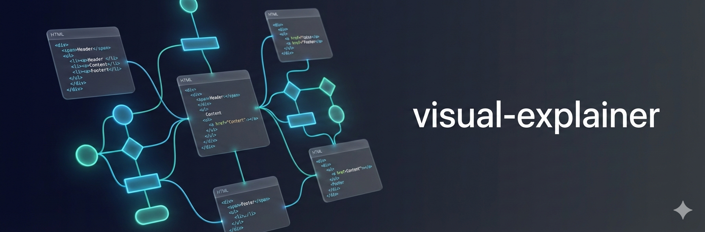

<p>
  
</p>

# visual-explainer

**An agent skill that turns complex terminal output into styled HTML pages you actually want to read.**

[](LICENSE)

Ask your agent to explain a system architecture, review a diff, or compare requirements against a plan. Instead of ASCII art and box-drawing tables, it generates a self-contained HTML page and opens it in your browser:

```
> draw a diagram of our authentication flow
> /review
> /review ~/docs/refactor-plan.md
```

Each one produces a single `.html` file with real typography, dark/light theme support, and interactive Mermaid diagrams with zoom and pan. No build step, no dependencies beyond a browser.

https://github.com/user-attachments/assets/55ebc81b-8732-40f6-a4b1-7c3781aa96ec

## Why

Every coding agent defaults to ASCII art when you ask for a diagram. Box-drawing characters, monospace alignment hacks, text arrows. It works for trivial cases, but anything beyond a 3-box flowchart turns into an unreadable mess that nobody would put in a presentation or share with a team.

Tables are worse. Ask the agent to compare 15 requirements against a plan and you get a wall of pipes and dashes that wraps and breaks in the terminal. The data is there but it's painful to read.

## Install

The skill follows the [Agent Skills specification](https://agentskills.io/specification). Clone it into your agent's skills directory:

```bash
# Pi
git clone https://github.com/nicobailon/visual-explainer.git ~/.pi/agent/skills/visual-explainer

# Claude Code
git clone https://github.com/nicobailon/visual-explainer.git ~/.claude/skills/visual-explainer

# Other agents — point at the directory containing SKILL.md,
# or paste its contents into your system prompt
```

For Pi, restart after cloning. To get the slash commands (`/review`, `/project-recap`, etc.), copy the prompt templates:

```bash
cp ~/.pi/agent/skills/visual-explainer/prompts/*.md ~/.pi/agent/prompts/
```

If you have [surf-cli](https://github.com/nicobailon/surf-cli) installed, the skill can also generate illustrations via Gemini Nano Banana Pro and embed them in pages. The agent detects surf automatically and skips image generation if it's not there.

## Usage

The agent loads the skill when you mention diagrams, architecture, flowcharts, schemas, or visualizations. It also kicks in automatically when it's about to dump a complex table in the terminal (4+ rows or 3+ columns) — it renders HTML instead and opens it in the browser. Output goes to `~/.agent/diagrams/`.

The skill ships with four prompt templates:

| Command | What it does |
|---------|-------------|
| `/generate-web-diagram` | Generate an HTML diagram for any topic |
| `/review` | Visual diff review or plan review (auto-detects from input) |
| `/project-recap` | Mental model snapshot for context-switching back to a project |
| `/fact-check` | Verify accuracy of a review page or plan doc against actual code |

`/review` is probably the most useful. It auto-detects whether you're reviewing a diff or a plan:

```
/review                        # diff review: feature branch vs main (default)
/review abc123                 # diff review: single commit
/review #42                    # diff review: pull request
/review ~/docs/refactor-plan.md  # plan review: compare plan against codebase
```

For diffs, it generates before/after architecture diagrams, KPI dashboard, structured Good/Bad/Ugly code review, decision log with confidence indicators, and re-entry context. For plans, it cross-references every claim against the actual codebase, produces current vs. planned architecture diagrams, and flags risks and gaps.

`/project-recap` is designed for context-switching back to a project after days away. It scans recent git activity and produces an architecture snapshot, decision log, and cognitive debt hotspots. `/fact-check` takes any document that makes claims about code and verifies every one of them.

## How It Works

```
SKILL.md (workflow + design principles)
    ↓
references/           ← agent reads before each generation
├── css-patterns.md   (layouts, animations, theming, depth tiers)
├── libraries.md      (Mermaid theming, font pairings)
└── responsive-nav.md (sticky sidebar TOC for multi-section pages)
    ↓
templates/            ← agent reads the matching reference template
├── mermaid-flowchart.html (Mermaid + ELK + handDrawn — emerald tint)
├── data-table.html   (tables with KPIs and badges — indigo tint)
└── walkthrough.html  (interactive step-through — violet tint)
    ↓
~/.agent/diagrams/filename.html → opens in browser
```

The agent picks an aesthetic direction, reads the right reference template, generates a self-contained HTML file with both light and dark themes, and opens it. All three templates share a unified editorial palette (white bg, Merriweather headings, Inter body) with per-template tint colors for subtle differentiation. The skill handles Mermaid diagrams (flowcharts, sequences, ER, state machines, mind maps), CSS Grid architecture layouts, HTML tables, interactive walkthroughs, and dashboards — routing to the right approach automatically.

To customize the output directory, browser command, or add your own diagram types and CSS patterns, edit the files directly. The agent reads them fresh each time.

## Limitations

- Requires a browser to view — no inline terminal rendering
- Switching OS theme requires a page refresh for Mermaid SVGs (CSS-styled elements respond instantly)
- Results vary by model capability — the skill provides design guidance, not pixel-perfect specs

## Credits

Borrows ideas from [Anthropic's frontend-design skill](https://github.com/anthropics/skills) and [interface-design](https://github.com/Dammyjay93/interface-design), adapted for one-shot diagram generation.

## License

MIT
